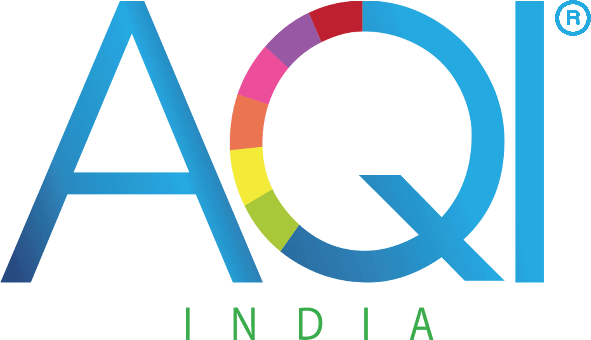
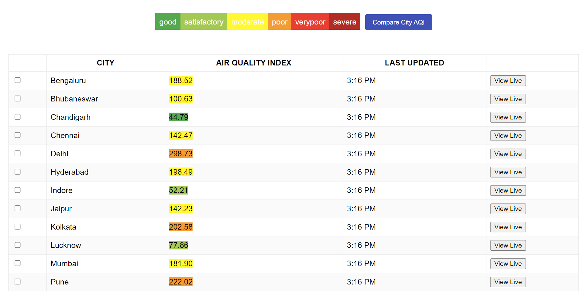
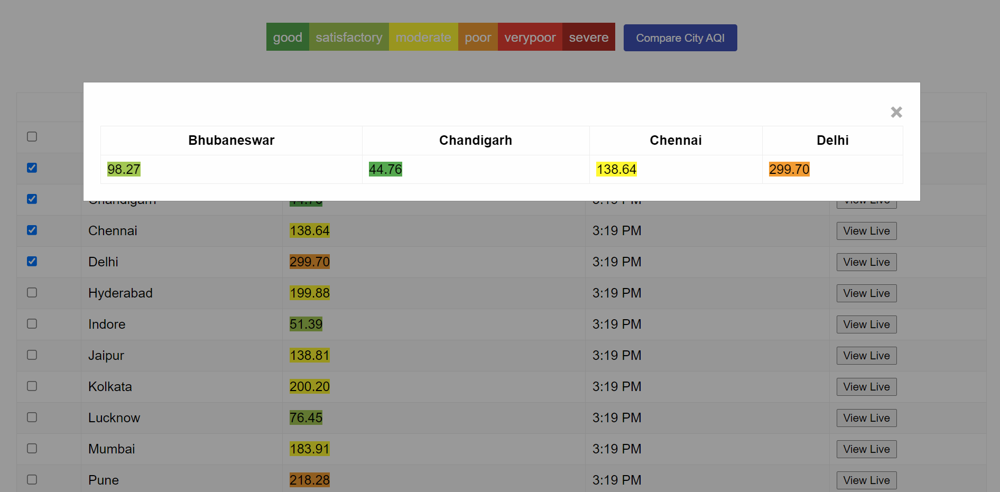
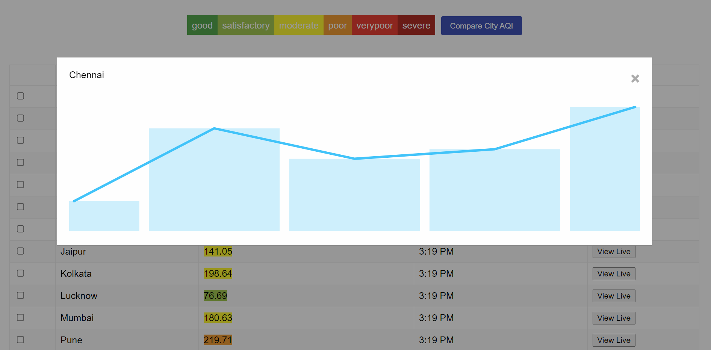

# Air Check App

<br />
<p align="center">
  <a href="https://github.com/Ganesh1991/react-aqi">
    
  </a>

  <h3 align="center">AQI APP</h3>

  <p align="center">
    An awesome README template to jumpstart your projects!
    <br />
    <br />
    <br />
    <a href="https://react-aqi.vercel.app/">View Demo</a>
    ·
    <a href="https://github.com/Ganesh1991/react-aqi/issues">Report Bug</a>
    ·
    <a href="https://github.com/Ganesh1991/react-aqi/issues">Request Feature</a>
  </p>
</p>

<!-- TABLE OF CONTENTS -->
<details open="open">
  <summary>Table of Contents</summary>
  <ol>
    <li>
      <a href="#about-the-project">About The Project</a>
      <ul>
        <li><a href="#built-with">Built With</a></li>
      </ul>
    </li>
    <li>
      <a href="#getting-started">Getting Started</a>
      <ul>
        <li><a href="#prerequisites">Prerequisites</a></li>
        <li><a href="#installation">Installation</a></li>
      </ul>
    </li>
  </ol>
</details>

<!-- ABOUT THE PROJECT -->

## About The Project





### Built With

This project was bootstrapped with [Create React App](https://github.com/facebook/create-react-app).

Used below third party library for showing live chart information

- [React Sparklines](https://www.npmjs.com/package/react-sparklines)

<!-- GETTING STARTED -->

## Getting Started

### Installation

1. Clone the repo
   ```sh
   git clone https://github.com/Ganesh1991/react-aqi.git
   ```
2. Install NPM packages
   ```sh
   npm install
   ```
3. Run
   ```sh
   npm start
   ```
   <!-- USAGE EXAMPLES -->

## Details

1. Added custom react hook which communicates with the Websocket
2. Created Grid component to render the AQI information. It also accepts component as props while rendering the grid cell information
3. On Landing screen user can see the City wise AQI information.
4. User can select different cities to compare the AQI information in realtime
5. Also user can view city wise live chart of AQI information
6. Used React.memo within components to avoid renders as data is getting updated in realtime.

<!-- LICENSE -->

## License

Distributed under the MIT License. See `LICENSE` for more information.

<!-- CONTACT -->

## Contact

Your Name - [@your_twitter](https://twitter.com/Ganesh_SD) - ganeshdeshmukh108@gmail.com

Project Link: [https://github.com/Ganesh1991/react-aqi](https://github.com/Ganesh1991/react-aqi)
